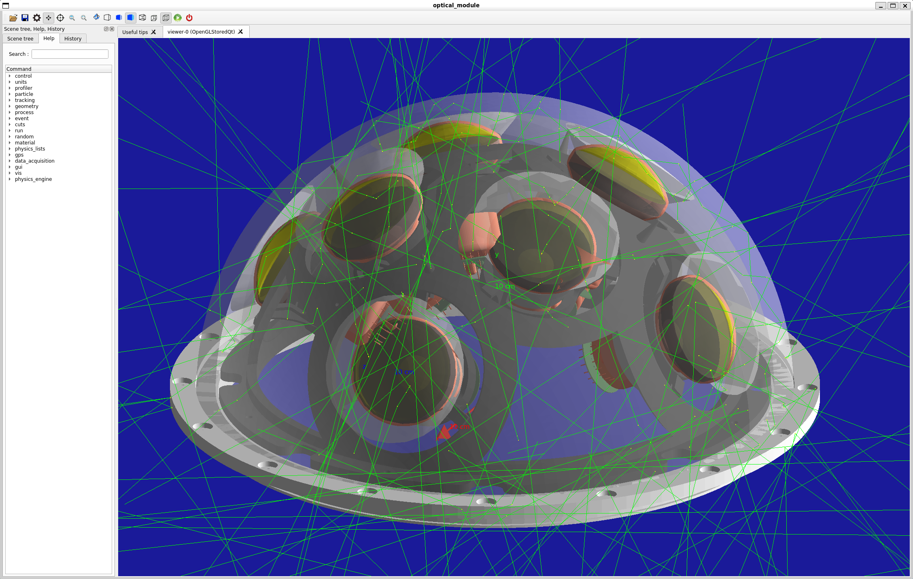

# P-ONE Optical Module Geant4 Simulations

## Overview

This is a Geant4 implementation of the P-ONE Optical Module (P-OM), designed to simulate the acceptance of the module and to test its geometry.

As the P-OMs geometry is both complex and constantly changing due to the ongoing development process, and a precise implementation of its geometry is needed to accurately reflect the modules acceptance to photons, it ws not seen as feasible to implement the geometry directly in C++.

Instead, the existing SolidWorks CAD Drawings of the P-OM were used as a baseline for the Geant4 geometry and imported using an external converter.

The P-OM Geant4 implementation offers a full implementation of the P-OMs geometry, as well as a full PMT implementation with both reflector and realistic photocathode. It was build with easy controllability in mind, offering a series of macro and configuration files, through which geometry, data acquisition, visualization, optical properties and primary photon generation can be controlled.

## Requirements

* Geant4 >= 11.0.2 build with GDML flag enabled
* xerces >= 2.4.2 build with curl. Needed by Geant4 to properly load GDML files

 
## How To Use

This repository uses CMAKE and can be build accordingly.

To start the simulation in interactive mode, simply run `optical_module --interacive`. The macro file [init.mac](macros/init.mac) will be read in which triggers all other macro files, geometries etc. to be read in by the simulation. Geant4s visualisation executive will start automatically.

To start the simulation in batch mode, run `optical_module --batch`. The macro file [init.mac](macros/init.mac) will be read as well, however with the adidonal [run.mac](macros/run.mac) being executed. Here, the user can specify runtime behavior of the simulation.

## Geometry

The geometry for the Geant4 P-OM implementation was imported from SolidWorks utilizing object tesselation. Due to limits in the tesselation, small gaps and overlaps between neighboring objects can't always be avoided, wich causes problems for the simulation of optical photons. 

Because of that, a key optical component - the gelpad - was modelled by hand in C++, then fit in the correct places in the module with additional measures to make sure no gaps and overlaps appear. While based on an imported tessellated object, the PMTs were also modified by hand as to include reflective and absorbing components to produce realistic behavior.

PMTs and gelpads can be placed together via the `/geometry/optical_unit/place` command. (see [init_geom.mac](macros/init_geom.mac) for more info)

This repository comes with a slightly modified PDOR_v11 assembly which was converted into tessellated objects. Gelpads and PMTs were removed from the assembly as they are placed manually while minor components like o-rings and springs were removed to speed up initialization and runtime.

The user can import his/her own geometries in the GDML file format via `/geometry/gdml/file`. For the conversion, a tool like [GUIMesh](https://github.com/nretza/GUIMesh) can be used. It should be noted that after import, the simulation loops over all daughter volumes of the imported world volume and assigns material-, optical-, and visual properties depending on the name of the Volume (i.e. a Volume of name "Glass_Hemisphere" is assigned glass properties etc.). The user should take care that all volumes are appropriately named.

## Optical Properties

Optical Properties of different materials are defined in [optical_properties.cfg](macros/optical_properties.cfg). These are usually dependent on the photon energy and are thereby given in arrays. These arrays are automatically read in in during initialization and assigned to the correct material or surface.

## Primary Photons

Photons are created using the `G4GeneralParticleSource` which has the advantage of it being completely controllable by macro commands. The GPS commands can be found in [init_primary_photon.mac](macros/init_primary_photon.mac).

Per default, Photons are created on a sphere of radius 5 meters with a momentum pointing inwards. the momentum is uniformly distributed around the inwards pointing normal of the sphere with a maximum deviation of 3 degrees from the normal. this assures that the P-OM is hit from all possible angles on all possible points.

## Primary Muons

As an alternative to Photons, primary muons can be generated using the `G4GeneralParticleSource`, wich then produce Cerenkov photons registered in the P-OM. The GPS commands can be found in [init_primary_mu.mac](macros/init_primary_mu.mac). Cuts for the production of Cherenkov photons are set in [init_physics.mac](macros/init_physics.mac).

Per default, a muon with 1 Tev energy is generated on a trajectory perpendicular to the P-OM, passing it at about 5 m distance at its closest point.

## Data Aquisition

The Simulation outputs data in text formats. The output file can be set via `/data_acquisition/output_file`. The user should take care not to accidentally overwrite already existing data.

An output file contains information for a single run, where each line represents one photon track (with one track per event, as no secondary particles exist). The different columns represent:
* __PID__: The Particle ID. -22 for photons, 13 for muons.
* __in_E__: The initial energy (in EV) of the photon
* __in_xyz__: The initial position of the photon.
* __in_pxyz__: The initial momentum direction of the photon
* __g_xyz__: The position of the first contact point between the particle and the P-OM glass. Will be filled by zeros if the particle does not touch the glass.
* __g_pxyz__: The momentum direction at the first contact point between the particle and the P-OM glass. The direction is taken before refraction! Will be filled by zeros if the particle does not touch the glass.
* __out_E__: The final energy (in EV) of the photon
* __out_xzy__: the location where the photon track is terminated
* __out_VolumeName__: The name of the volume in which the photon track is terminated.
* __out_Volume_CopyNo__; The copy nr. of the volume. Used to uniquely identify PMTs. 
* __out_ProcessName__: The name of the process that terminates the photon track.
